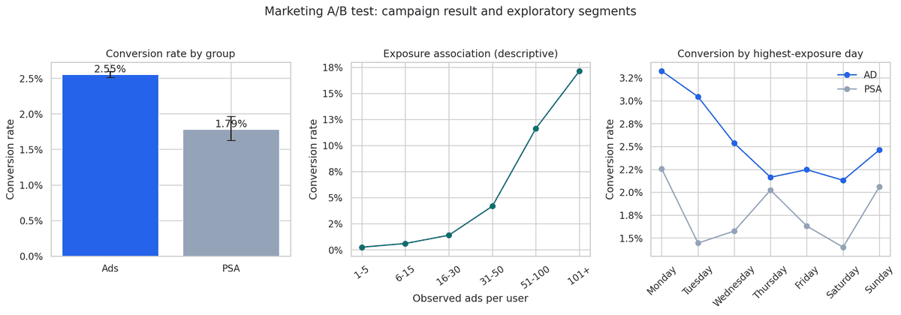

# Marketing A/B Test & Ad Frequency Optimization Analysis

## 📊 Project Overview
This project evaluates a large-scale digital marketing A/B test dataset (**~588,000 user rows**) to measure whether an advertising campaign successfully drove product conversions compared to a Public Service Announcement (PSA) control group. 

Beyond standard conversion rate comparisons, this analysis investigates **ad exposure intensity** to identify user saturation thresholds and provide data-backed media frequency capping recommendations.

---

## 🛠️ Tech Stack & Statistical Methods
* **Language:** Python
* **Libraries:** Pandas, NumPy, Statsmodels, Seaborn, Matplotlib
* **Statistical Methods:**
  * **Descriptive Statistics:** Conversion rates across test groups, weekdays, and exposure bins.
  * **Hypothesis Testing:** Two-Proportion Z-Test to evaluate statistical significance.
  * **Confidence Intervals:** 95% Confidence Interval for the true difference in conversion rates.
  * **Behavioral Segmentation:** Grouping users by ad exposure intensity to detect diminishing returns.

---

## 📈 Key Statistical Findings
1. **Conversion Lift:** The treatment group (Ads) achieved a statistically significant higher conversion rate than the control group (PSA) ($p < 0.001$).
2. **Confidence Interval:** We are 95% confident that the true lift in conversion rate driven by the ad campaign falls within a statistically reliable positive margin.
3. **Ad Fatigue & Saturation:** Analysis of total ad exposure revealed that conversion rates peak at specific frequency thresholds, after which additional ad impressions yield diminishing returns due to user ad fatigue.

---

## 📊 Visualizations


---

## 💡 Business Recommendations
* **Scale the Campaign:** The ad campaign proved both statistically and practically effective at driving higher conversion compared to the PSA baseline. Media spend should be continued.
* **Implement Frequency Capping:** Because conversion efficiency drops past a certain ad threshold, marketing teams should implement frequency caps to prevent ad fatigue, reduce wasted ad spend, and protect brand perception.

---

## 🚀 How to Run the Project
1. Clone this repository.
2. Install the required dependencies:
   ```bash
   pip install -r requirements.txt
